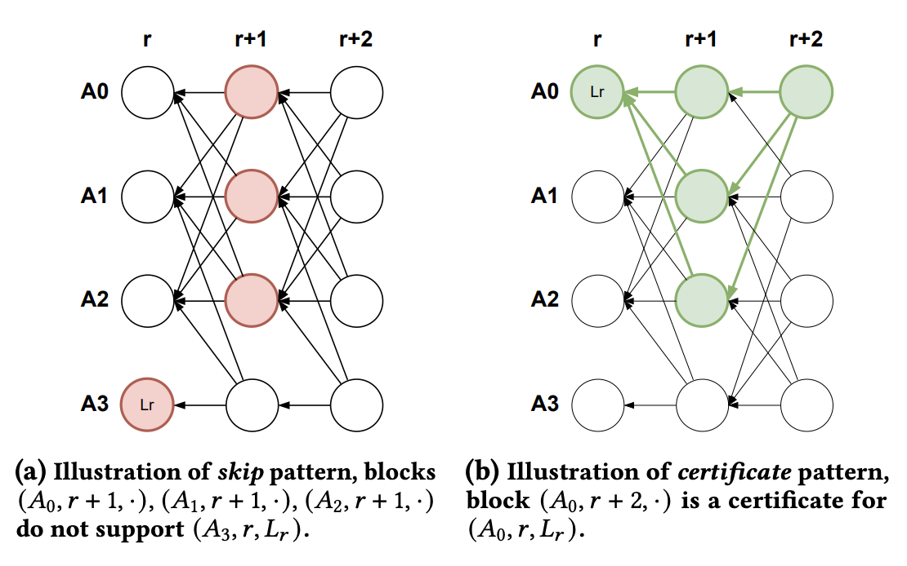
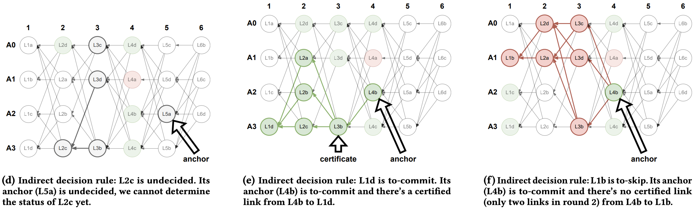

# Consensus

Network validators participate in consensus to agree on the embedding history, account balances, stake distribution, and the network participants.

## Byzantine Fault Tolerance

Byzantine Fault Tolerant (BFT) consensus is a fundamental building block for distributed systems that allows a set of computers to agree on common values, even if some of the computers are faulty. In this context, we desire to reach consensus on the state of the shared embedding space, as well as the ordering of transactions to embed data and allocate rewards. We'd like to do this in a way that minimizes latency while maximizing network throughput for embedding vast amounts of data.

## DAG-based Consensus

DAG-based consensus algorithms are a class of BFT consensus algorithms that are particularly well-suited for this task. Validators send messages containing blocks of transactions to each other, with each block containing references to previous blocks that it has seen. This creates a directed acyclic graph (DAG) of blocks, where each block is a vertex and each reference is a directed edge that acts as a vote towards proposed blocks. Each validator can look at its local view of the DAG, containing all the messages it has received, and decide which blocks are valid using the DAG structure alone. This allows the network to reach consensus on the state of the shared embedding space and the ordering of transactions without any additional communication overhead.

Our consensus mechanism is based on the [Mysticeti](https://arxiv.org/pdf/2310.14821) protocol, a state-of-the-art DAG-based consensus algorithm designed for high throughput, fast transaction finality, and low CPU / network overhead. It can support up to 100k transactions per second with sub-second finality, even in the presence of faulty nodes.

## Blocks

The consensus protocol operates in *rounds*. Within every round, a validator proposes a *block* of fresh transactions and sends it to the network. The other validators receive the block, validate its correctness, and vote on it by referencing it in their own block for the next round. Once a block contains
references to at least **2𝑓 + 1** blocks from the previous round (where **𝑓** is the number of faulty nodes), the validator signs it and sends it to other validators. In this case, **2𝑓 + 1** validators represent at least 2/3 of the network.

## DAG Patterns

Once blocks are received, the DAG structure must be interpreted to reach consensus on the ordering of blocks and their transactions. 

We say a block *B* in round *r* is **certified** if at least **2𝑓 + 1** blocks in the following round *r + 1* have *B* as a reference. A block in any subsequent round (i.e. *r + 2*) is a **certificate** for block *B* if it contains the blocks that certify block *B* in its history. Therefore, the soonest a block may be certified is 2 rounds after it is proposed.

We say a block *B* in round *r* is **skipped** if at least **2𝑓 + 1** blocks in the following round *r + 1* do not have *B* as a reference. In all subsequent rounds, there is no way for a block to be a certificate for block *B*, therefore it may be safely skipped.

From these two patterns, we can derive conditions on which to commit a sequence of blocks from a node's local view of the DAG.

## Block Ordering

In every round, validators assigned to slots. If the DAG's structure allows validators to commit a block, blocks are ordered by slots within rounds. There are two ways in which a proposed block may be committed to the ordered sequence:

1. **Direct Decision Rule**
* A block *B* is **committed** if **2𝑓 + 1** certificates are observed for that block. In other words, there are **2𝑓 + 1** different blocks that are linked to **2𝑓 + 1** blocks that have block *B* as a reference. 
* A block *B* is **skipped** if it simply observes the skip pattern. In other words, **2𝑓 + 1** blocks in the following round do not have *B* as a reference. 
* A block *B* is **undecided** if it is neither committed nor skipped. It is ultimately decided using the *indirect decision rule*.

2. **Indirect Decision Rule**
* To decide an **undecided** block, we first search for an *anchor*. This is the first block in round ** r' > r + 2** that is **committed**.
* If the anchor references a certificate to *B*, i.e. it references a block that references **2𝑓 + 1** blocks that reference *B*, we can **commit** the undecided block.
* If the anchor does not reference a certificate to *B*, we must **skip** it.

A validator may incrementally process its local view of the DAG to commit blocks to the ordered sequence, up until it first sees an *undecided* block. The transactions seen in the committed blocks are considered *finalized* in the ordering within the sequenced block. This allows the network to reach consensus on the ordering of transactions.

