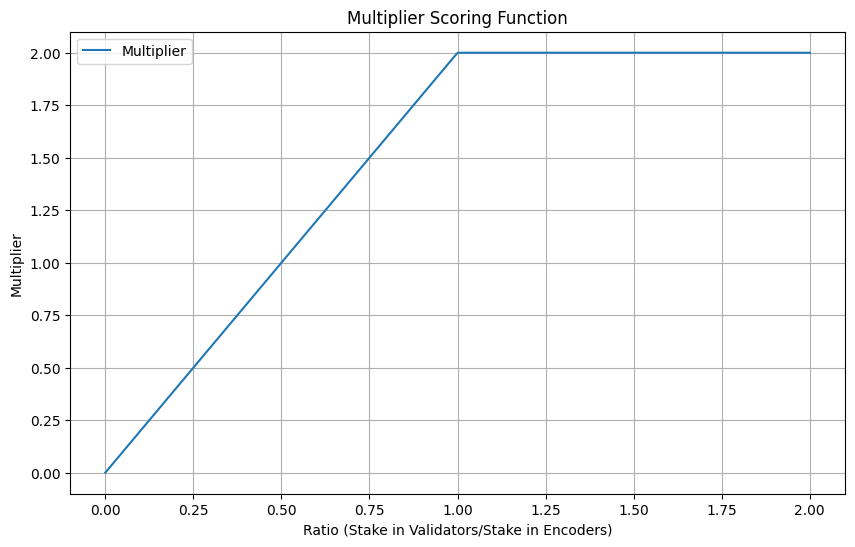
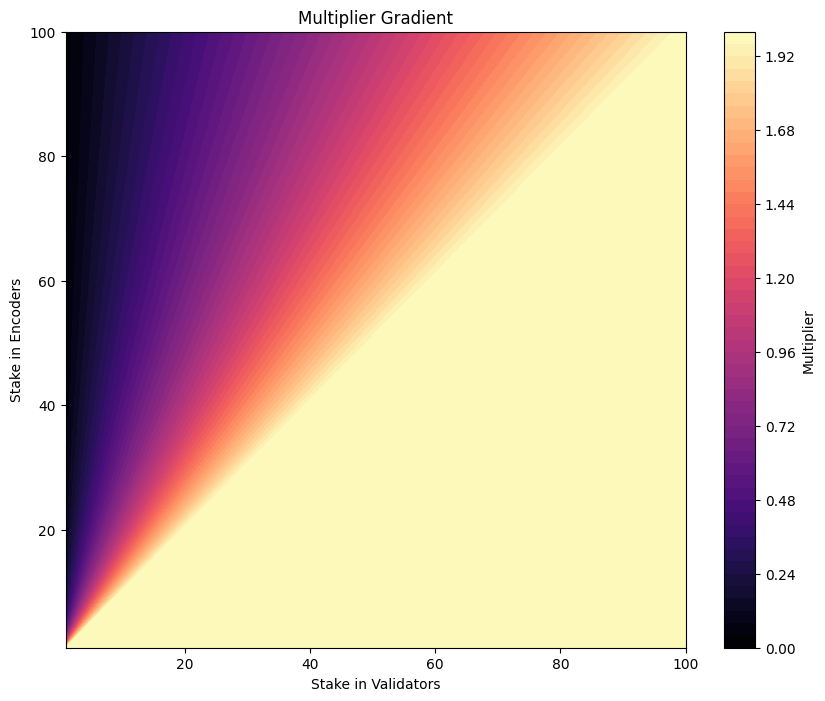

# Delegated Stake

The network relies on stake and delegated stake for security and to deter Sybil attacks. Stake requires the various participants in the network to have "skin in the game".

Since the network is split in functionality between validators and encoders, the staking system is built to encourage a 50:50 ratio between validator and encoder stake.

## Staking in Validators

Individuals that stake in their own validators or delegate to validators receive a proportional reward based on stake. As long as the validator does not act maliciously, there is minimal risk of losing stake. However, there is no performance related bonuses, as every validator performs the same required work.

The operators of validators may charge a commission for the service of running a node. The node operator can charge any percentage from 0-100%. The node operators can also change their commission percentage at any point. It is the delegators' responsibility to perform due diligence while selecting validators in which to stake.

The staking system allows for anyone to stake tokens in any address, which creates a stake account for that address. If that address is operating a validator, rewards are distributed to the stake accounts for the given validator address. While it is possible to stake or unstake at any time, the changes do not go into effect until the next epoch change. During the interim period, the stake is ineligible for rewards.

A delegator can allocate their entire stake to validators without allocating to any encoders. This offers a low risk and predictable reward as long as the validator is well-behaved.

## Staking in Encoders

Validators receive network rewards proportional to stake. However, encoder rewards and slashing is dependent on performance. The strong performers get richer and the low performers get slashed.

Staking in a encoder is therefore much higher risk, but also rewards higher relative to simply staking in a validator. Additionally, staking in encoders has diminishing returns. This is due to the fact that rewards are not received in proportion to total encoder stake, but rather proportional to the encoder's performance. Staking in a encoder also increases its chance of being selected to produce embeddings. Encoders are slashed for poor performance or a lack of participation (liveliness faults).

## Virtual Stake

The rewards generated and dispersed by an Encoder are split with the delegated stakers. Except unlike validator stake, encoder rewards are distributed proprotionally based on **virtual stake** not the staked amount alone. To encourage staking in both validators and encoders, an account multiplier is applied based on the ratio of total stake in validators vs total stake in encoders.

The account multiplier's max value is 2.0. Why 2? If the 50:50 ratio is maintained between validators and encoders, the delegator gets rewarded with a virtual stake worth the full amount of their locked tokens.



The scoring function is a piece-wise. The multiplier is linear up to a ratio of 1.0, then flat at y=2.0.

```python
def scoring_function(ratio):
    if ratio >= 1.0:
        return 2.0
    else:
        return 2.0 * ratio
```



It is in the delegators best interest to rebalance their positons to maintain a 50:50 ratio between validators and encoders. An added benefit of this is slashing and account delegation can happen independently across both validaor and encoder systems with little impact on each other.

## Minimum Stake

To further protect the system from Sybil attacks, the network will require a minimum amount of stake in order to join the network. A 100 tokens stake requirement per validator, and 10 tokens per Encoders seems like a reasonable starting point. Minimum stake can be changed via governance if necessary.
