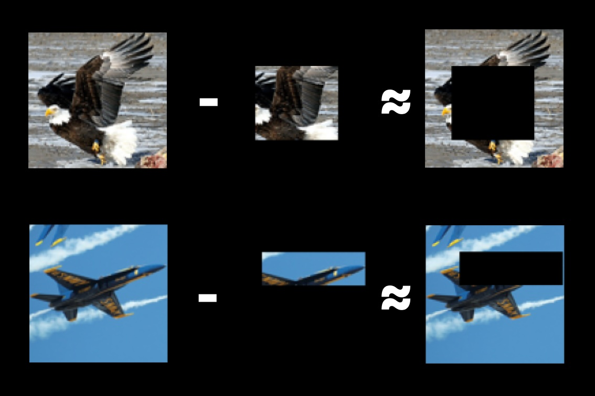

# Differential Loss
Differential loss leverages the unique property of embeddings to be composable, allowing the decomposition and reconstruction of semantic components within data. 

This concept is exemplified by the well-known relationship in Word2Vec:

```
Embedding("king") - Embedding("man") + Embedding("woman") ≈ Embedding("queen")
```

Embeddings are powerful because they can capture semantic relationships within data. Differential loss evaluates the embeddings' ability to maintain these relationships when parts of the data are masked. This composability is crucial for understanding subcomponent semantics within the data.

To evaluate embedding performance, we examine the loss by assessing how well certain parts of the data add or remove semantic meaning. Specifically, we measure:

```
Embedding(full_data) - Embedding(mask) ≈ Embedding(inverse_mask)
```




## Reducing Cheating with Differential Loss
As the complexity and overlap of masks increase, cheating at differential loss becomes more challenging. The non-linearity of generating embeddings from data or masks further complicates attempts to exploit the system. This complexity ensures a robust evaluation of the model's compositional understanding. The goal of differential loss is to effectively make it such that gradient-based estimation is the easiest way to perform well. 

## Lower Communication Overhead
Evaluating embeddings in the embedding space requires substantially less bandwidth compared to traditional methods that evaluate performance in the data space. This reduction in communication overhead is particularly advantageous in distributed systems where bandwidth efficiency is critical. The size of a 1024 dimensional embedding is 4kb whereas an image can get into the Gbs. 

## Objective Performance Measurement
Differential loss allows for an objective, unsupervised measurement of model performance. By evaluating how well a model can decompose and recompose embeddings, we can apply a consistent scoring system without requiring labeled data. Additionally we do not rely on trusted oracles, trusted model-evaluation nodes, or purely averaging subjective responses that ultimately lead to stagnation in performance.

## Performance Weighted Averaging
Using the differential loss score as a weighting factor helps boost important features the final embedding. Using an average is beneficial because we can capture the benefits of ensembling responses to improve capacity, and reduce variance. Another benefit of averaging is transfer learning, where the embedding models teach each other slightly. Using a performance score allows the network to learn from the best encoders and can combine features of embeddings that may have been otherwise selected as an outlier.

## Outlier Filtration

Having an objective performance score allows us to relax how we treat outliers. While outlier filtering is important for maintaining consensus over the embedding space, it is important to enable more intelligent encoders to shift the embedding space if it results in better performance. Using a naive approach of a simple average would require more aggressive outlier filtering because malicious encoders could shift the final embedding significantly. With the differential loss score, the network can objectively figure out which encoders should shift the embeddings and by how much. Therefore the use of outlier filtering is just to stop obviously wrong embeddings that are far from consensus on where the embedding should be in space. 

Local outlier factor (LOR) is calculated for every embedding relative to their peers in a shard. LOR impacts overall score.


## Conclusion
Differential loss provides a robust framework for evaluating the composability and semantic understanding of embeddings. By measuring the ability to decompose and recompose data accurately, differential loss offers a unique and effective approach to model evaluation, reducing communication overhead and enabling unsupervised performance measurement. This method's adaptability and efficiency make it a valuable tool in the development and assessment of embedding models in a permissionless environment.