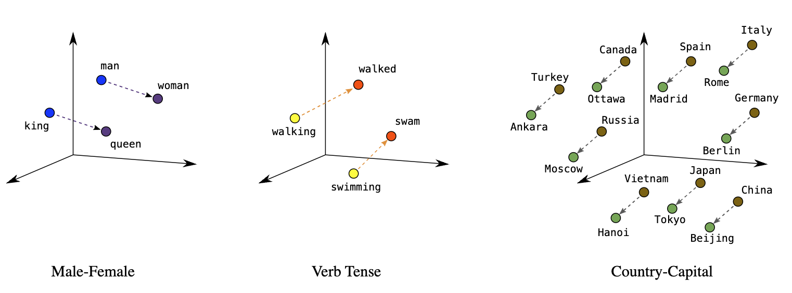
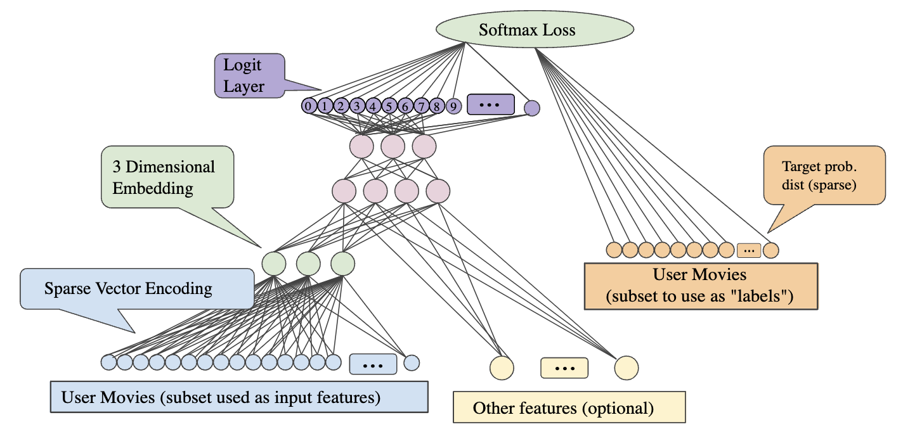
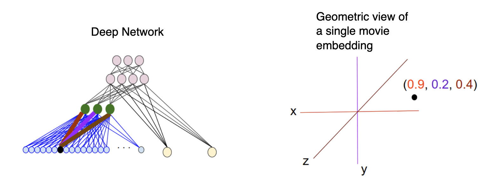

# Embeddings

Embeddings are low-dimensional vector representations of data. Embeddings make it easier to do machine learning on large inputs, including text, images, and videos. 

The distance between two embeddings measure the semantic similarity of the underlying data. Small distances indicate similarity, while large distances indicate dissimilarity.

Position (distance and direction) in the space can encode semantics in a good embedding. For example, the following visualizations of real embeddings show geometrical relationships that capture semantic relations.

An embedding can be learned and reused across models, transferring knowledge from one model to another. Each dimension of the embedding expresses a unique feature about the data that can be used for a variety of applications.

### Embeddings for Search

In search, the goal is to retrieve semantically similar data given an input. A variety of applications can be supported in this way such as semantic search, answering questions, or summarization.

To perform a search, we embed the query, which may be natural language. Then we calculate cosine similarity between the resulting query embedding and each of the other embeddings. The highest cosine similarity results are most relevant.

*Multimodal embeddings* can be used to search across different data domains. The text, image, and video embedding vectors are in the same semantic space with the same dimensionality. Therefore, these vectors can be used interchangeably for use cases like searching images by text, or searching video by image.

### Embeddings for Classification

Embeddings present an elegant way of predicting a numerical value or a class for a piece of data. Because the semantic information contained within embeddings is high, the prediction is decent even with very few samples.

They can be used to *cluster* similar data points together. This can make it easy to find data points in a given category or to identify outliers.

We can even use embeddings for zero shot classification without any labeled training data. For each class, we embed the class name or a short description of the class. To classify some new text in a zero-shot manner, we compare its embedding to all class embeddings and predict the class with the highest similarity.

### Embeddings for Recommendations

Because shorter distances between embedding vectors represent greater similarity, embeddings can be useful for recommendation. These recommendations can be based on user behavior, content, or both, for items or advertisements.

## Why are embeddings important?

Embeddings enable deep-learning models to understand real-world data more effectively. They simplify how real-world data is represented while preserving the semantic relationships.

#### The Problem with High-Dimensional Data

1. **Size of Network**: Huge input vectors mean a huge number of weights for a neural network. A large number of weights causes further problems:
    - **Amount of data.** The more weights in your model, the more data you need to train effectively.
    - **Amount of computation.** The more weights, the more computation required to train and use the model. It's easy to exceed the capabilities of your hardware.
2. **Lack of Meaningful Relations Between Vectors**: High-dimensional vectors don't have any inherent structure. The distance between two data vectors doesn't tell you anything about the similarity of the items they represent. This makes it hard for a model to learn about the relationships between items.

The solution to these problems is to use embeddings, which translate large vectors into a lower-dimensional space that preserves semantic relationships. 

#### Reducing Data Dimensionality

Embeddings are used to represent high-dimensional data in a low-dimensional space. Dimensions are typically features or attribute of the data. For example, an image can be considered high-dimensional data because each pixel color value is a separate dimension.

While we want enough dimensions to encode rich semantic relations, we also want an embedding space that is small enough to allow us to train our system more quickly. A useful embedding may be on the order of hundreds of dimensions. 

Models require more computational power and time to learn, analyze, and infer from high-dimensional data. Embeddings reduce the number of dimensions by identifying commonalities and patterns between various features. This reduces the computing resources and time required to process raw data, and often helps improve a model's performance.

#### Training large models

Embeddings improve the quality of training data for models such as large language models (LLMs). Pre-trained models can repurposed by adding new embeddings to transfer new knowledge, without retraining the entire model. This allows a model to be fine-tuned with custom datasets for specific applications.

## Creating Embeddings

To create embeddings, a neural network is trained to predict some property of the data. For example, you can train a neural network to predict the next word in a sentence. The weights of the network at the output layer are the embeddings.

When learning a *d*-dimensional embedding each item is mapped to a point in a *d*-dimensional space so that the similar items are nearby in this space. This embedding layer can be combined with any other features and hidden layers. As in any deep neural network, the final layer will be the loss that is being optimized. 

For example, let's say we're using a neural network to predict a movie a user would be interested in from the movies other users have watched. Here the input layer would the movies each user has watched, and the output layer would be the movie the user is likely to watch next. The embedding layer would be the *d*-dimensional space where each movie is represented as a point. The network would learn to predict the embeddings of the movies.

The image above helps to illustrate the relationship between the weights learned in the embedding layer and the geometric view. The edge weights between an input node and the nodes in the *d*-dimensional embedding layer correspond to the coordinate values for each of the *d* axes.