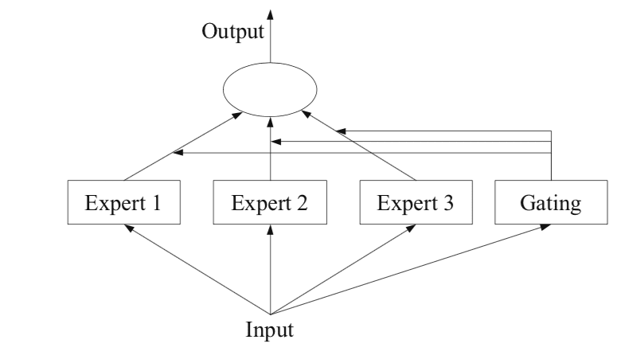

# Market of Experts

[Differential loss](differential_loss.md) allows us to objectively measure the performance of specific models. Using [shards](shards.md) of models we are able to introduce redundancy, align embeddings between models, leverage the advantages of ensembling, and transfer learn between models.

However, there are physical constraints to the individual models that can be run. GPT4 is rumored to be 1.76 trillion parameters. Running a 1.76 trillion parameter model is expensive and we cannot assume that every participant will run a large parameter model.

## Quadrillion Parameter Question?

How do we increase the parameter capacity of the network as a whole without being physically limited to the max model size that one encoder can run?

The answer is market forces.

## Mixture of Experts (MOE)

Most modern large language models, leverage a technique called Mixture of Experts to scale their model capacity. *(source for MoE)* While the practical implementation can vary, the core idea is to route the data to a smaller part of the network that is knowledgable about that area, the "expert."

The MOE architecture relies on a learned gating function. The gating function acts as a router, passing the input signal to specific experts. To tune the gating function, the model is working to minimize its overall loss, but additional methods can be employed to encourage specialization.

## Market Forces

Given the permissionless nature of the network, we optimize through incentives.

Remember, when embeddings are generated by a shard, there is only one model that wins the reward for performing the work, and the models inside of a given shard are selected randomly.

The key is to introduce the ability to ask another model for help via proxy. If the proxy model wins the reward, the person who proxied to it splits the fees. If a model has received a piece of data that they know they will perform poorly at, they are economically incentivized to route that data to a model that they believe will win.

> A simple way to think of this is calling a friend on a game show.

By introducing this simple concept of a proxy, we get two new dynamics to improve network performance:

1. Specialization
2. Competition

Encoder models are now economically encouraged to become good at specific areas in the embedding space that offer a high return with lower competition. Furthermore, if a certain area of the embedding space has high demand (a lot of data passes through that area), there are now incentives to compete to improve performance and win rewards.

## Routing

How will a model selected in a shard for a piece of data know whether they can do well or not on a piece of data? *(wording)* Quite simply they try to encode the data into an embedding. Given the generated embedding, they can look up historically which model typically wins in that area of the embedding space and the average differential loss they have. If they beat the historical models, then they should submit the data. If they lose, they should proxy to one of those winning models.

## Latency

A proxied model can only participate on behalf of one person in the shard. There is then a race to contact the best proxy model and claim them for work. Because the slowest models (or proxies) in a shard get [slashed](fees_rewards_and_slashing.md), there is a strong incentive to either do the work or proxy as quickly as possible such that the chosen model can deliver an embedding before the slowest models.
