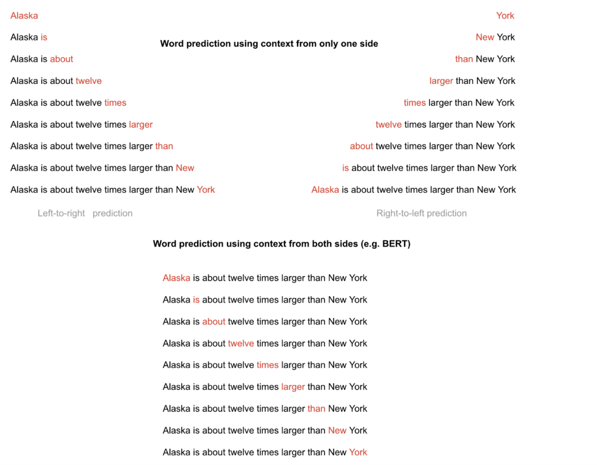
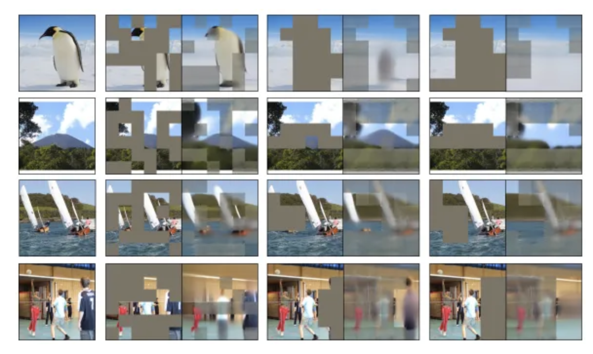
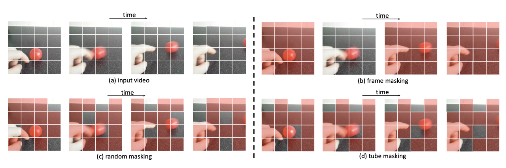

# Masking Input Data

In order to self-improve the shared world model, embeddings must be assessed objectively. This poses the question: ***what makes a high-quality representation?***

## Encoders and Masking

In machine learning, masking input data was found to be surprisingly successful in producing high performing models. The original Transformer [paper](https://arxiv.org/pdf/1706.03762) trains its language encoder by **masking** the tokens at the end of a sequence, prompting the model to learn how to predict the next token. 

The seminal [BERT](https://arxiv.org/pdf/1810.04805) paper showed increasing performance when masked pretraining was applied to not just the end of the sequence, but *random* parts of the sequence. Models learned not just to predict the future, but to predict any missing data with whatever sequential relationship it could grasp.

The insights from masked language modeling made its way to the visual domain via the [Vision Transformer](https://arxiv.org/pdf/2010.11929) (ViT). By subdividing an image into ***patches*** and tasking the model with predicting masked regions of a sequence patches, the network learns both semantic and spatial relationships between different areas of the image. ViT replaced convolutional neural networks as the state-of-the-art architecture for computer vision.

More recently, generative video models, such as OpenAI's [SORA](https://openai.com/index/video-generation-models-as-world-simulators/), are trained via masking spatiotemporal "tubelets" from video clips. Interestingly, as the data modality becomes more *dense* with information, the optimal masking ratios required to train competitive models *increases* (e.g. ~15% masking in training data for text sequences, ~85% for images, >90% for videos).

## Enshrined Network Masking

The network makes the following assumption: ***high-quality representations of data capture the semantics of its subcomponents***. The performance metric in the [following section](differential_loss.md) builds on this assumption through masking.

Prior to embedding, every encoder in a shard masks the input data with a common set of distinct random masks.

### Modality-Specific Tokenization and Masking Ratios

For every modality of data, a different mechanism is used to break the data into units of a sequence. The network shares a common and upgradable tokenizing mechanism for each modality:

* For **text**, the [SentencePiece](https://github.com/google/sentencepiece) tokenizer is used. A fixed **15%** elements of the tokenized sequence are masked.
* For **images**, the images are broken into 16px by 16px patches and flattened. A fixed **85%** elements of the tokenized sequence are masked.
* For **videos**, clips are broken into 16px by 16px patches extended across 2 subsequent frames and flattened. A fixed **90%** elements of the tokenized sequence are masked.

As the network upgrades to support new modalites, each modality will have a corresponding tokenizer.

### Deterministic Randomness

After input data is tokenized, a set of **deterministic seeds** aree passed into a pseudorandom number generator (PRNG) to determine which elements of the sequence an invididual encoder must mask. The seed is combination of:
- The hash of the last [committed block](consensus.md) from the previous [epoch](epochs.md)
- The hash of the input data
- The index of the mask in the array of masks

By using a deterministic mechanism, masking can be verifiably correct across encoder in the shard.