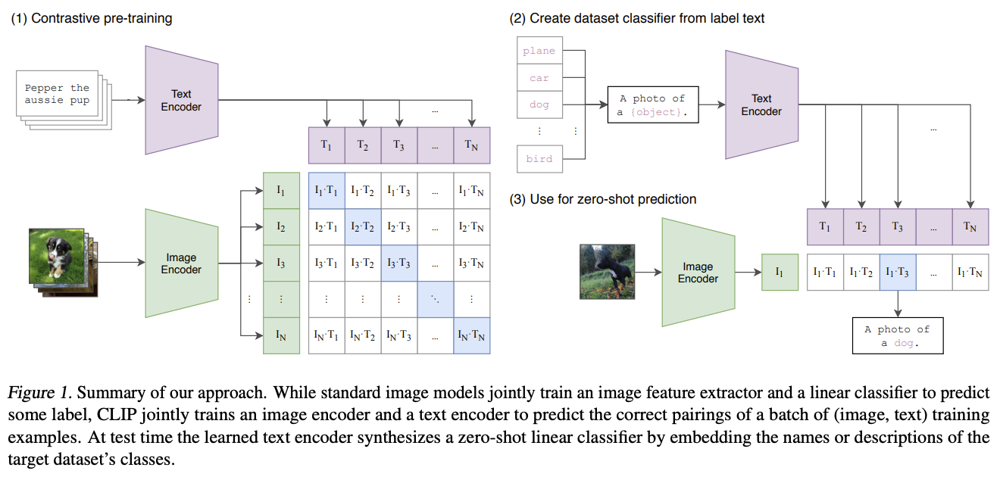
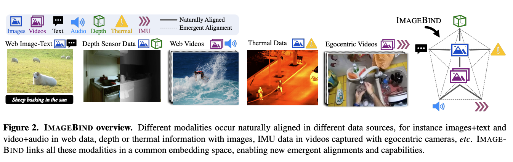

# Multimodality

The network supports the unification of embeddings in different modalities, including text, images, video, and audio. The idea is that embeddings produced by the network retain modality-specific semantic structure while being endowed by shared semantics across modalities. Every encoder participating in the shared embedding space is responsible for encoding any modality of data, outputting embeddings with the shared space's dimensionality.

## Multimodal Encoders

The paradigm in multimodal encoders is to pretrain dual encoders on positive pairs (e.g. image-text à la [CLIP](https://arxiv.org/pdf/2103.00020)) and map their individual embeddings to a shared embedding space. The loss function used for training is simply the difference between the individual embeddings of the different modalities in the pair.

[ImageBind](https://arxiv.org/pdf/2305.05665) presents a way of learning a joint embedding space across six different modalities using only pairs of data, rather than inputs from all six modalities. Unseen pairs of modalities can be inferred by the network, and emergent alignment between these modalities is achieved.

## Pairing in Proof of Curiosity

Similarly, to guarantee that the network can be trained to understand similarities between modalities, the [Proof of Curiosity](proof_of_curiosity.md) mechanism rewards additional token incentives for the submission of **pairs of different modality data**. 

The encoders align on two different embeddings, one for each element in the pair, using a [differential loss](differential_loss.md)-weighted average. Each embedding is *averaged with the other* with a modality-specific weighting, endowing cross-modality information to either embedding. To combat invalid pair submissions, if the pair of final embeddings are too far from each other, the pair is disqualified from being rewarded, and the weighted average is not applied. The final embeddings are produced together as output.

The system can be extended to support new modalities in future upgrades.