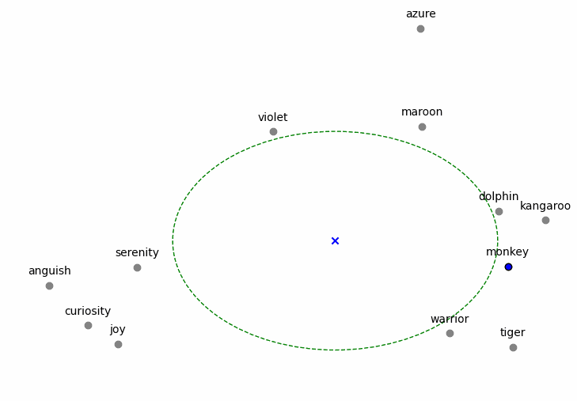

# Proof of Curiosity

While any piece of data can be embedded by the network, not all data is equally valuable in ***improving the shared world model***. It is crucial to incentivize the submission of data that fills *gaps* in the embedding space, as this data is the most valuable for improving the network's understanding of the world.

In every epoch, network tokens are rewarded for the piece of data that best fills a gap in knowledge in the known embedding space. This incentivizes the embedding of novel data that is not well-represented in the current embedding space, a mechanism called *Proof of Curiosity*.

## Mechanism

Validators assess whether an embedding fills in a gap in space by finding its *nearest neighbors* from the historical embeddings, then calculating the average distance between the centroid of those neighbors. 

The centroid is the **center of the gap** being filled, and the average distance between the centroid and the neighbors is the **size of the gap**.

## Scoring

\\[d_{nn} = \frac{\sum_{i=0}^N|C - nn_i|}{N} \\]

1. A person submits a piece of data that is transformed into the embedding space.
2. The embedding is used to approximately calculate the \\(k\\) nearest neighbors \\(nn\\).
3. The neighbors \\(nn\\) are used to calculate the centroid \\(C\\) or mean of the cluster.
4. **The average distance \\(d_{nn}\\) from each neighbor is calculated from the centroid.**

To validate that the embedding is not too far from the centroid, we compare it against a *cutoff* value as follows:
1. The distance \\(d_{E}\\)  from the embedding to the centroid is calculated.
2. \\(d_{E}\\)  is checked to see if it is less than or equal to ⅓ of \\(d_{nn}\\) , otherwise the embedding is disqualified.

This scoring mechanism incentivizes both specialization in areas of the embedding space and exploring new boundaries of knowledge. Approximate nearest neighbors algorithms (such as [NGT](https://opensource.com/article/19/10/ngt-open-source-library)) can be used to efficiently determine the nearest neighbors for the embedding. 

The reward mechanism can be adjusted to proportionally reward the top N scoring embeddings for an epoch to more frequently reward gap-filling data submissions.

## Synthetic Data

Aside from randomly guessing, winning the Proof of Curiosity game requires knowing the space of historical embeddings and having the ability to *produce* a piece of data from a target gap-filling embedding. This may require **generating** synthetic data, using a diffusion model or other methods.

A ***perpetual feedback loop*** of better representations and higher quality gap-filling data should lead to richer embeddings for downstream applications.