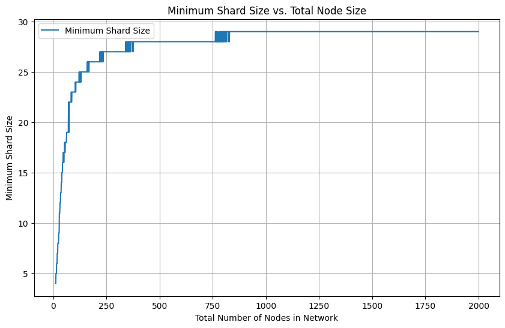

# Shard Selection
To enhance network throughput, minimize communication overhead, and reduce redundant computation, the network selects smaller shards of encoders to generate embeddings for each data piece.

## Deterministic Shard Selection
Using a network-defined random seed, validators can perform a weighted sample from all nodes based on their stake (own stake + delegated stake). Each epoch, the network reaches consensus on the participating encoders and updates the cumulative stake. With the updated stake list, the random seed, and a hash of the data, the shard for a data piece is determined deterministically and asynchronously.

## Consensus on Final Embedding
A quorum of 90% of the shard is required to return an embedding for the data. This consensus method ensures that a substantial majority within the shard must agree, providing robustness against dishonest nodes.

## Monte Carlo Simulations
Monte Carlo simulations showed that using this method results in satisfactory low probabilities of dishonest majorities across all tests.

## Calculating Shard Size
The hypergeometric distribution can be used to calculate the shard sizes from a given security budget (probability of dishonest majority) and total number of encoders. While the hypergeometric distribution does not capture the stake distribution, it works for an initial estimation. In the future, shard size calculation may also factor in stake distribution. 

## Security Budget Estimation
Utilizing a Poisson distribution, it is possible to estimate the time between events at various security budgets based on the theoretical max embeddings per second. Since encoder shards do not control balances in a significant way, a mean and median time between events of a couple years is enough of a deterent given that poor-performing encoders are slashed. 

## Key Takeaway

The network's sharding approach allows it to scale out horizontally. Because shard sizes statistically scale at a much slower rate relative to the total number of nodes, the network can efficiently handle an increasing number of nodes while maintaining security and performance.
