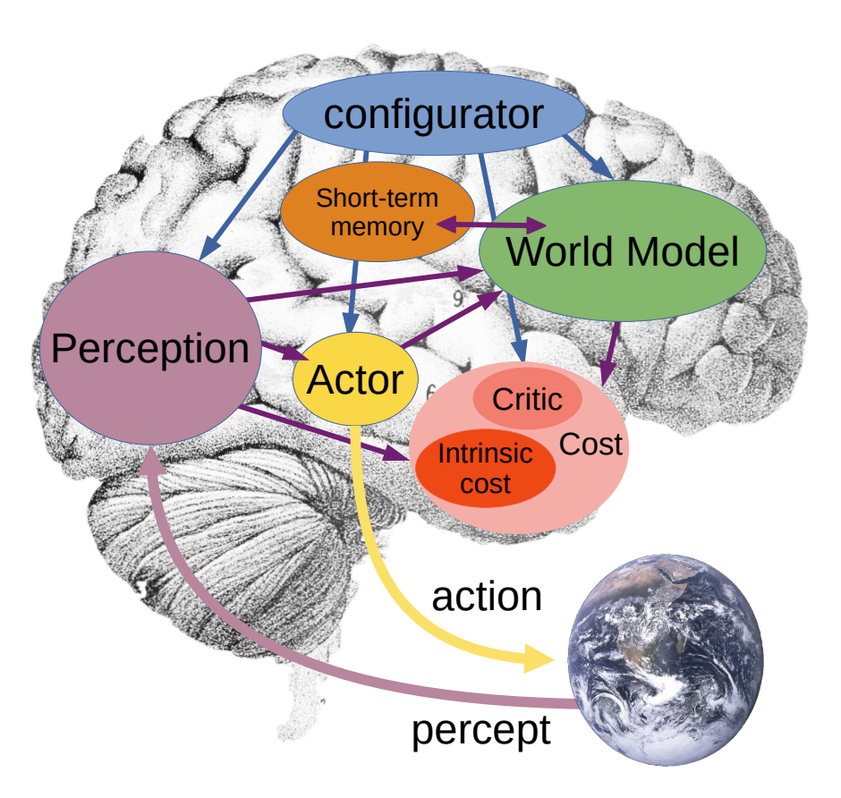
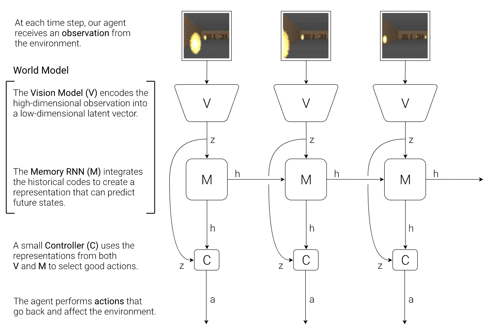
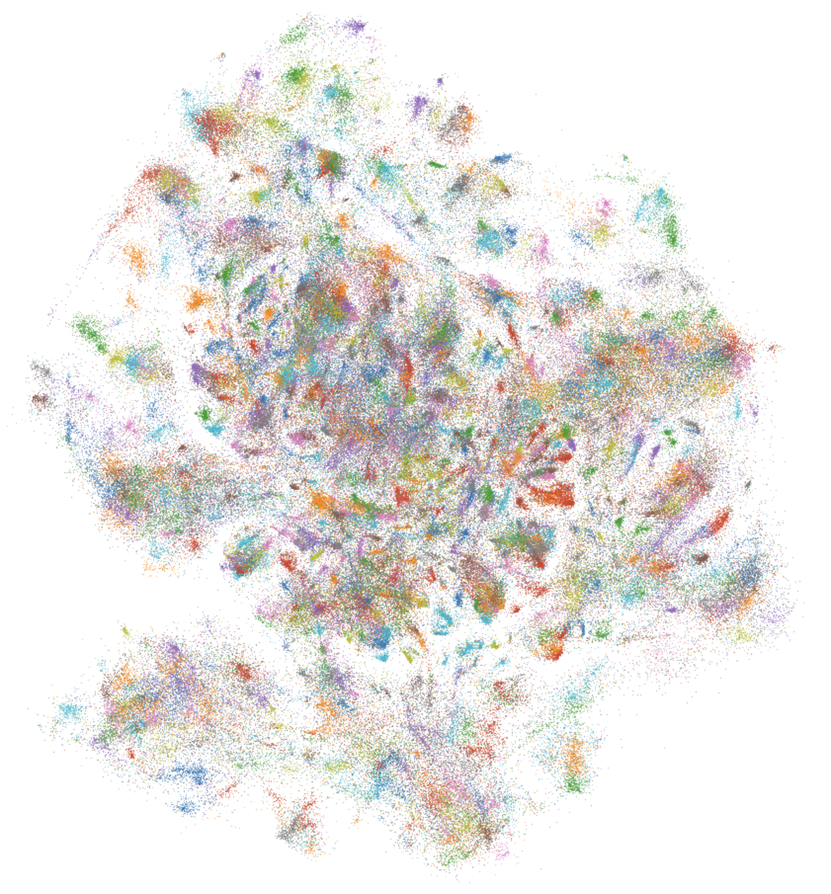

# Shared World Model

The ability for humans to learn and understand the world is currently far beyond the capabilities of machines. We can learn quickly, generalize to new situations, and continuously update our understanding of the world with very little guidance. Machines on the other hand need to be trained on vast amounts of data to learn even the simplest of tasks, and struggle to adapt to new situations without retraining.

Our intelligence may in great part be a result of our capacity to learn *world models*. We build representations of the world in order to make predictions and plan actions. We constantly update this model as we observe new things. What we call "common sense" is the result of this ***continuous*** learning process, and it tells us what is likely, plausible, and impossible in a given situation. Using world models, humans learn new skills with very few trials in a task-independent, unsupervised manner.

## World Models

The role of the world model is:
1. To estimate missing information about the stae of the world not provided by perception
2. To predict future states of the world

In order to do this, the world model must have an abstract representation space, or **[embedding](embeddings.md) space**, that contains all the information necessary to make these predictions. It should also be self-aware of its own limitations and uncertainties, and be able to seek the information it needs to improve its understanding.

## Barriers

Large language models have showcased some of these *zero-shot* and *few-shot* learning capabilities, but they are still far from the general intelligence of humans. 

These models are trained on vast amounts of data and require enormous computational resources to pre-train. Once trained, their model of the world remains static, and queries are required to fit within *context windows* to update the system with any information it may not have in the moment. Furthermore, they are trained on data that is biased towards a single party's collection and alignment criteria, rather than a more global understanding of the world. 

Thus, **resource constraints** and **representation bias** are two of the main barriers to creating the best representations for an accurate world model.

## A Better World Model

**Continuous Learning**. A world model should be able to continuously learn and update its understanding of the world. This requires a network that can continuously update its embeddings with new data.

**Incentived Resource Pooling**. Given its intrinsic value, a world model should acquire the resources driven by the demand for its representations. Networks such as Bitcoin have shown that by incentivizing participants to contribute resources, a decentralized network can be built that accumulates more resources than a centralized one. Given that computational resources are the main bottleneck in training large models, a decentralized network can provide more resources to training a world model than any single entity.

**Decentralized Knowledge Acquisition**. A world model should be able to acquire knowledge from a diverse set of sources. This requires a network that can accept data from a variety of sources and ensure that the data is not biased towards a single party's collection criteria. The network should also be able to incentivize **filling gaps** in the world model's understanding.

## A Shared Multimodal Embedding Space

By building a network of ***smaller***, ***diversified***, and ***competing*** encoders, embeddings can be produced in a way that continously update a shared world model. A shared embedding space is not only useful for a variety of tasks, but also continuously updated with new information and self-improving representations via market demand.

