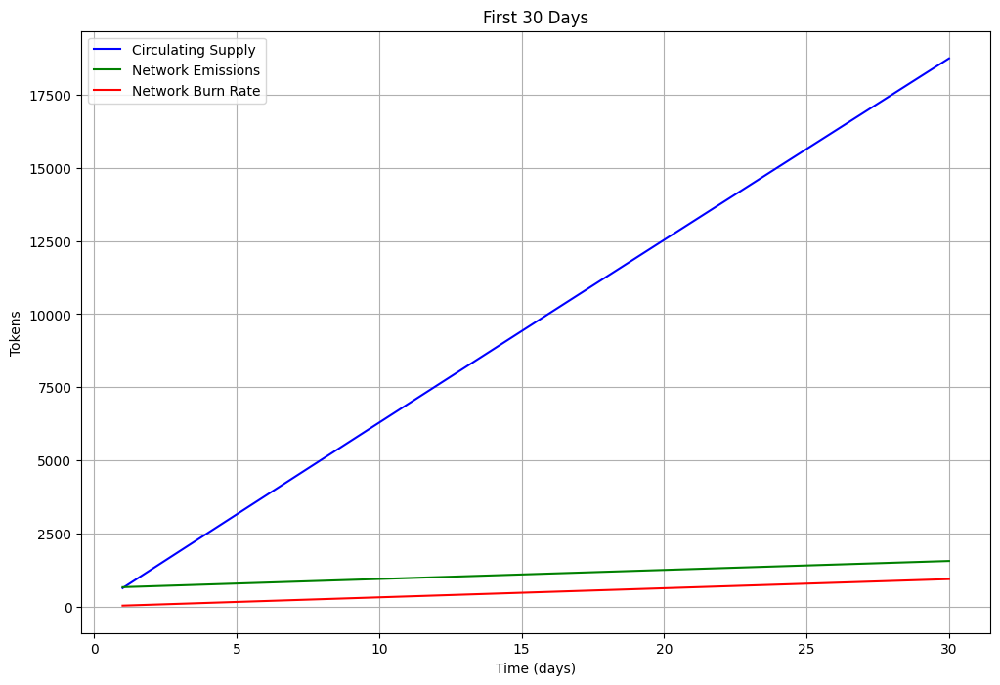
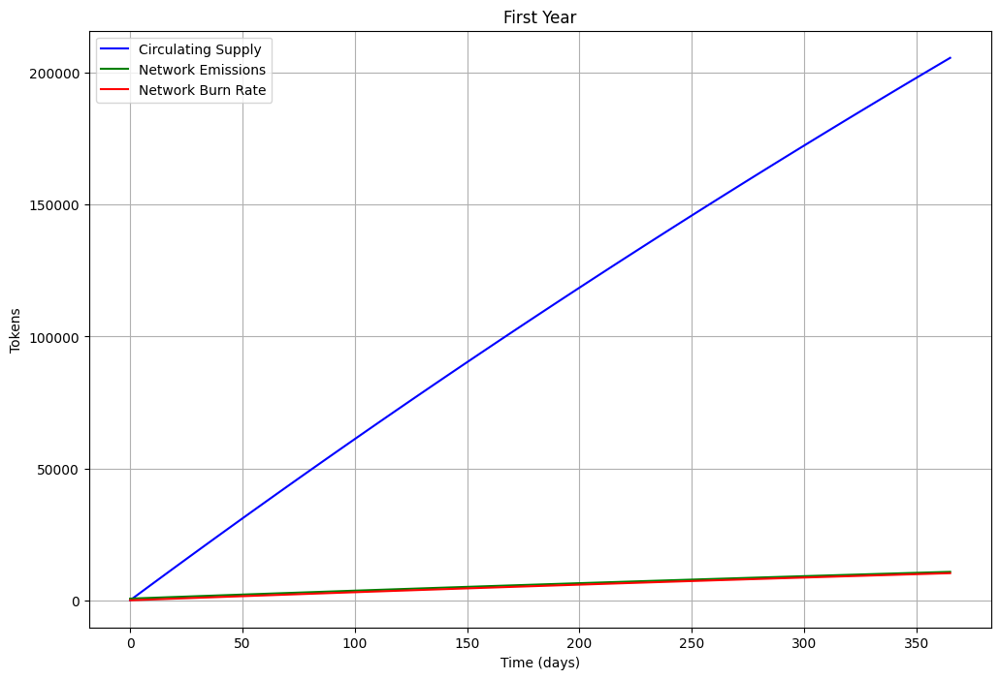
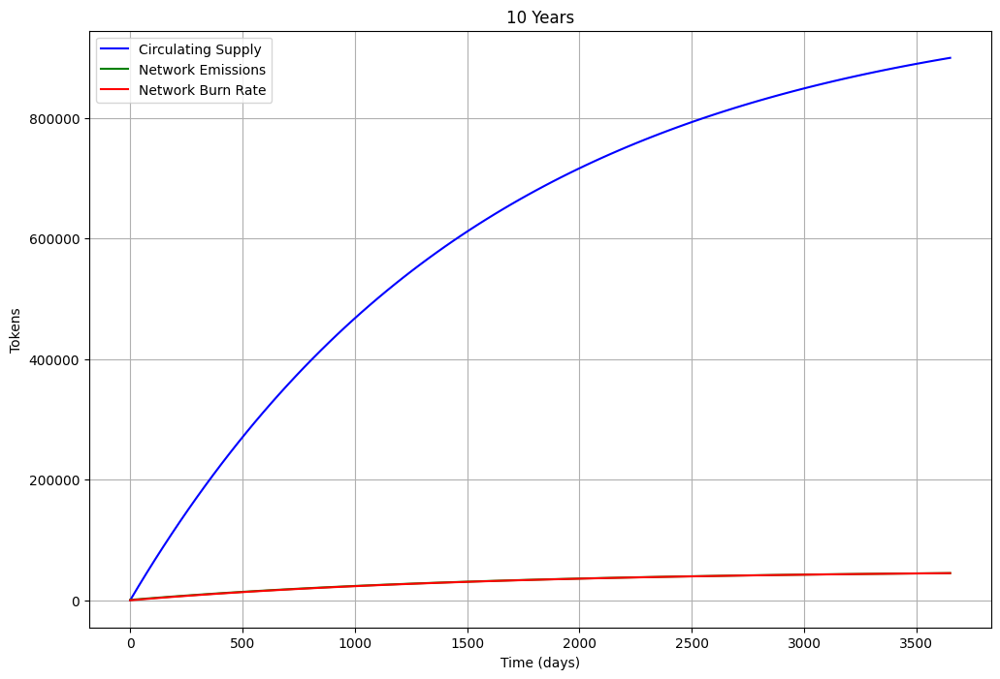
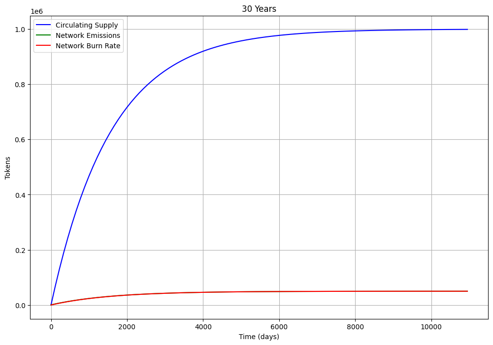

# Tokenomics

The network's token serves as the foundation for its economic model, ensuring sustainability and participation. This design aims for:

**Stable Functionality**: Guarantee continuous emissions to support essential operations like staking, data storage, and embedding space optimization.

**Meritocratic Ownership**: Gradually redistribute ownership to contributors over approximately 20-year cycles.

**Predictable Supply**: Provide a predictable monetary policy and safeguard against inflation, ensuring the token is a reliable store of value.

**Fair Distribution**: Implement a small but highly frequent reward system for equitable distribution.

## Economic Forces

There are three counteracting economic forces that control the monetary supply:

**Minting.** Token minting is controlled solely by a predictable mathematical formula that emits a certain amount of tokens at a given period of time. The token minting system has an exponential decay rate, such that more tokens are emitted earlier in the lifecycle of the network, similar to Bitcoin's halvings. The decay rate of emissions is calculated with a target total supply at a certain time, or 90% of the total supply emitted by 10 years of age.

**Burning.** When tokens are used in the network for staking, transactions, transfers, etc., there is a **fixed network burn fee** attached to the transaction. This fee is isolated from the cost of generating embeddings which is controlled by the market, similar to how gas fluctuates in other networks. The fixed transaction fee is similar to a tax which can be reused to service the public goods of the network. The burn fee uses a simple algorithm to approximate the sum of all fee annually to be close to 5% of the circulating supply. This means that as network usage increases, the fee per transaction decreases. 

**Emissions**. The network emissions distribute minted tokens, or redistribute tokens that have been burnt, to incentivize the healthy functionality of the network. These rewards are distributed to people that: run [validators](consensus.md), [delegate stake](delegated_stake.md) to validators, [submit valuable data](proof_of_curiosity.md), and generate embeddings. The emissions system can be tuned such that the split of rewards is dynamically changed to improve network functionality. By recycling the 5% burned tokens, we can ensure a steady network reward.

## Timeline

The objective of the economic systems is to ensure the healthy functioning of the network. The result is a system that becomes predictable in a short timeframe for all parties included.

Looking at the first 30 days we can see a noticable difference between the network emissions and burn rate. 

Within the first year, the difference between the emissions and network burn rate are just barely noticable.

At the 10 year mark, 90% of the supply is in circulation. The difference between emissions and burn is imperceptible.

At 30 years, the hard cap is evident at 1e6 (1 million tokens)

## Recap

The tokenomics are built to fairly distribute tokens, maintain healthy network functionality, and ensure a dependable monetary supply. We use a recycling method of burning tokens and emitting to ensure that the participants of the network are not subjected to large changes in the system but rather slowly and gradually approach a maintainable end state. As the network transactions scale, per transaction fees decrease. Part of governance is adjusting the emissions splits between the various subsystems to optimize stability.
