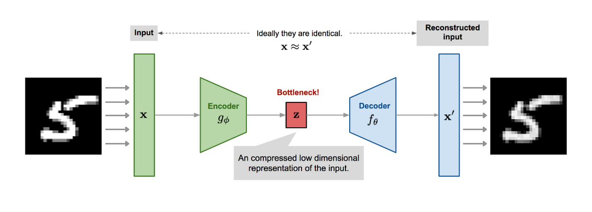
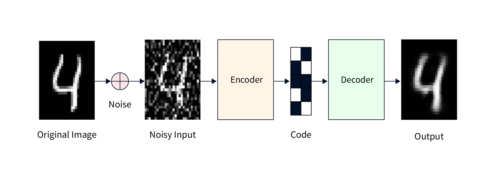
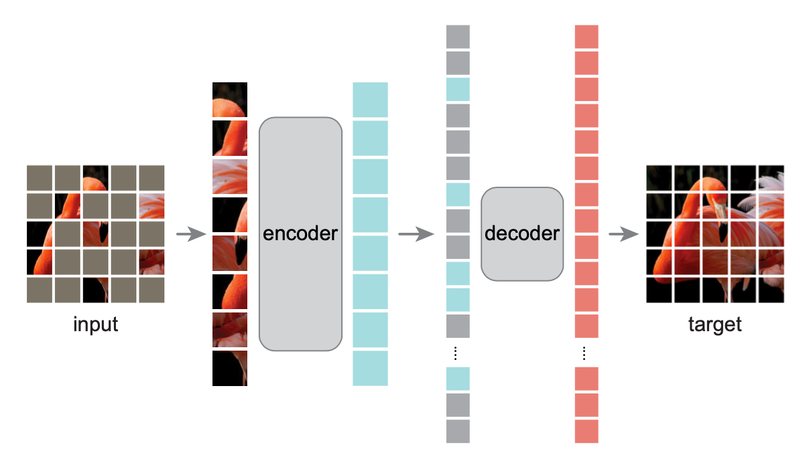
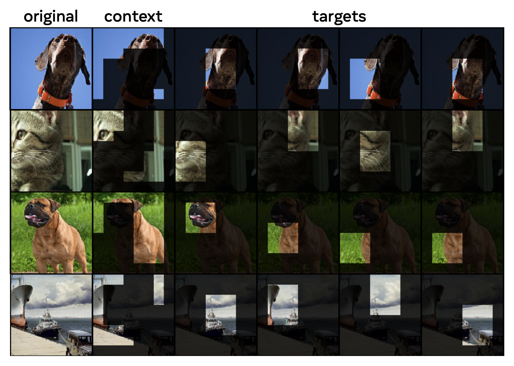

# Training Encoders

## Introduction to Encoders and Embeddings
Embeddings represent data in lower-dimensional spaces while preserving essential properties and relationships. Encoders are neural network architectures designed to generate these embeddings. The journey of training encoders has seen significant innovations, each improving the quality and utility of the generated embeddings.

## Early Approaches: Autoencoders

### Basic Autoencoders
Autoencoders are the earliest and simplest form of encoders. They consist of two parts: an encoder that compresses the input data into a latent space representation, and a decoder that reconstructs the original data from this representation.

Architecture: Typically, autoencoders have a symmetrical architecture where the encoder and decoder are mirror images of each other.

Training Objective: The primary goal is to minimize the reconstruction loss, usually measured by Mean Squared Error (MSE) or Binary Cross-Entropy (BCE).

### Denoising Autoencoders
Denoising autoencoders (DAEs) extend the basic autoencoder by introducing noise to the input data, forcing the encoder to learn more robust features.

Noise Introduction: Common techniques include adding Gaussian noise or masking random portions of the input.

Objective: The network learns to reconstruct the original, noise-free data from the corrupted input, enhancing robustness.

### Variational Autoencoders (VAEs)
VAEs introduce probabilistic elements to the encoder, allowing it to learn a distribution over the latent space rather than a fixed vector.

Latent Space Regularization: VAEs use Kullback-Leibler divergence to regularize the latent space, ensuring that the learned distribution approximates a prior distribution (e.g., Gaussian).

Applications: VAEs are particularly useful in generative tasks and anomaly detection.

## Advanced Techniques

### Contrastive Learning
Contrastive learning has gained popularity for learning high-quality embeddings by contrasting positive and negative samples.

Triplet Loss: One of the earliest methods in this category, triplet loss involves training the encoder to bring an anchor and positive sample closer while pushing the anchor and negative sample apart.

InfoNCE Loss: An improvement over triplet loss, InfoNCE is used in methods like SimCLR and MoCo, leveraging larger batches and multiple negatives for better performance.

### Masked Modeling

Masked modeling techniques, inspired by BERT in natural language processing, involve masking parts of the input data and training the encoder to predict the missing parts.

Masked Language Modeling (MLM): For text, tokens are masked, and the model predicts the original tokens.

Masked Image Modeling (MIM): Applied to images, patches are masked, and the model reconstructs the missing parts.

Objective: These techniques encourage the model to capture contextual information, leading to richer embeddings.

## JEPA

JEPA introduces a novel approach by evaluating embeddings in the embedding space rather than in the original data space. Using the embedding space is superior because it tests the understanding of semantic ideas rather than low-level specifics that may be less relevant. Another aspect of JEPA is the use of a secondary predictor model to predict the embeddings for missing pieces of data. The predictor helps improve the embedding model by signaling what features improve prediction.

JEPA's predictor model receives the embeddings for the context and predicts the embeddings for the targets.